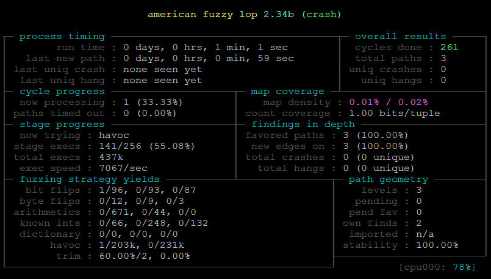
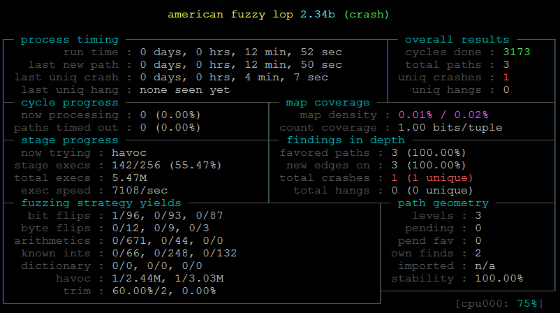

### Usage:
1 Compile code with afl-gcc    
```
	afl-gcc crash.c -o crash
```
2 Create initial test case    
```
	mkdir testcase
	echo "helloworld" > testcase/helloworld
	mkdir output
```
3 Run    
```
	afl-fuzz -i testcase/ -o output/ ./crash @@
```

### Screenshot



